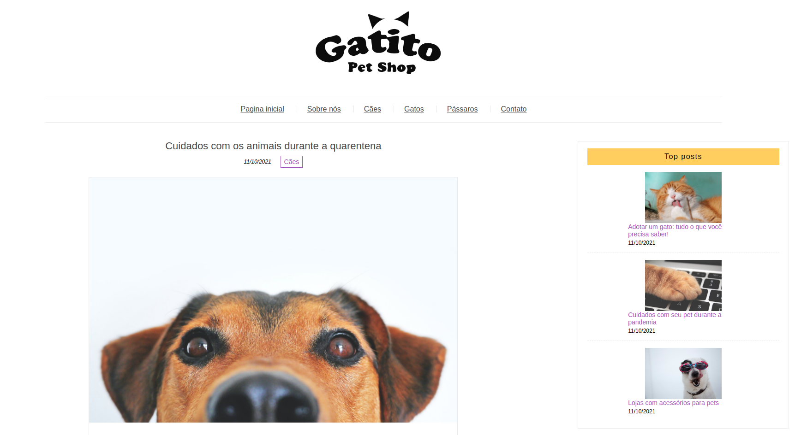

# gatito-blog

## Descrição do Projeto

Blog fictício desenvolvido em página estática para praticar conhecimentos de SASS.

<h1 align="center">  <a href="https://albertoscandido.github.io/projeto-sass/index.html">🔗 Link do projeto</a>  </h1>  
🚀 #VQV

# Sumário

  <a href="#objetivos">Objetivos</a> •  <a href="#tecnologias">Tecnologias</a>  • <a href="#desenvolvedor">Desenvolvedor</a>  

 

## Demonstração da aplicação
 

 
 

## Objetivos
Esse projeto foi desenvolvido visando desenvolver uma página estática e estilizar usando SASS!

## Tecnologias

- HTML
- Hooks
- <a href="https://sass-lang.com/">SASS</a>
- Css

 

### Habilidades

-   Responsividade
-   Layout
-   CSS
-   SASS

 
 

## Desenvolvedor

<a href="https://github.com/albertoscandido">**Alberto Candido**</a>
